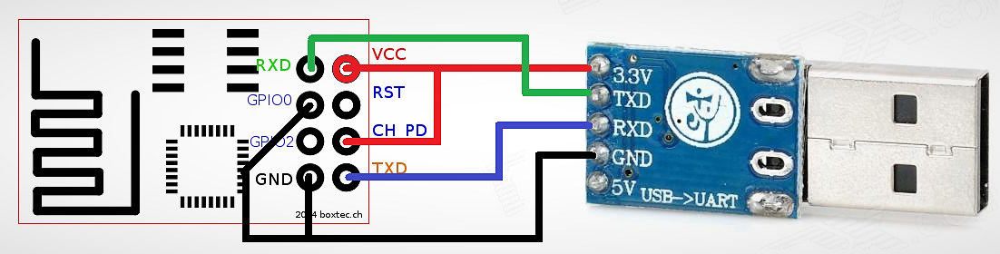

# Setup ESP8266 
## Requirement:
ESP8266 board with at least 1M flash. (Do not use 512k one for learning)
## NodeMCU Board
NodeMCU board is a development board.

[NodeMCU](https://github.com/nodemcu/nodemcu-firmware) is a firmware for ESP8266 WiFi SOC. It uses Lua language for development.
Currently this project does not use lua because of personal preference. [MicroPython](http://micropython.org) is used for development.
### Install MicroPython
[MicroPython for ESP8266 Tutorial](http://docs.micropython.org/en/v1.9.2/esp8266/esp8266/tutorial/index.html)

Official site said only [esptool](https://github.com/espressif/esptool/) is supported to flash the firmware. 
* install [esptool](https://github.com/espressif/esptool/), or just:
for Python 2
	* pip install esptool
for Python 3
	* pip3 install esptool
* Download micropython firmware from [github](http://micropython.org/download#esp8266), use the latest version. 
* NodeMCU board comes with USB micro B connection, so there is no need to wireup the flash circuit.
* Connect NodeMCU board with USB cable, identify the port. (On windows should be COM?, linux: /dev/tty??)
	* if device is not recognized, install the usb to serial driver. The driver depends what the board use. Check the rectangular chip on board. Reads as CH340G or Cp2102 or CH341
	* on windows, use command 'mode' in terminal
	* on linux, use 'ls -l /dev/tty\*', check the latest one
* erase old firmware
	* esptool.py --port COM4 erase_flash
* flash the firmware
	* esptool.py --port COM4 --baud 115200 write_flash --flash_size=detect 0 esp8266-20171101-v1.9.3.bin
* Connect with Putty
	* use Serial, baud: 115200, set parity and flow control to None
	* if no response: Reflash, add option --flash_mode dio. See [Issue](https://github.com/nodemcu/nodemcu-firmware/issues/2009)
	* if putty does not show anything, try reset the board.(Reset button on NodeMCU)
	* if see python interpreter, but could not input anything, make sure the parity and flow control on putty setting is None.
* NodeMCU board pinout
[NodeMCU board pinout](https://github.com/nodemcu/nodemcu-devkit-v1.0)

## ESP-01 board
ESP-01 board is from Ai-Thinker. ESP-01 has 512K flash, while ESP-01S version has 1M flash. We use ESP-01S here, because Micropython needs at least 1M to support the file system
ESP-01 is the simple version for ESP8266, which only exposes GPIO0 and GPIO2 interface. So if a project only needs two GPIO, ESP-01 is a good choice.
ESP-01 does not come with USB2Serial interface, so another usb2serial module is needed to flash the ESP-01.(Google for usb to ttl module)
And ESP-01 board is hard to used on breadbord. An adaptor is good for breadboard.(Google for image : esp01 breadboard adaptor)
* flash circuit

